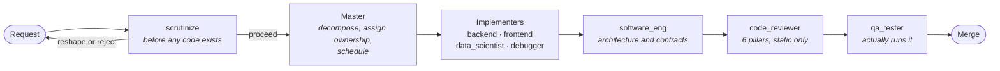
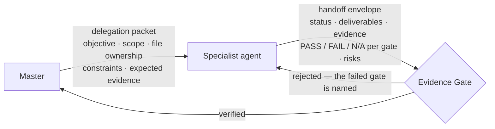
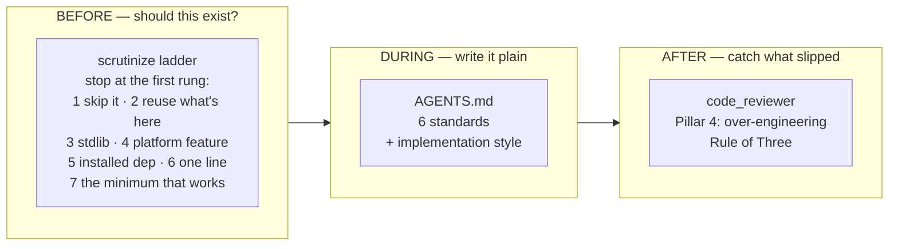

# code-agent

Canonical repository for the AXON agent system — coding personas, skills, and implementation standards shared between Claude Code and Codex.

This is not a framework you import. It is a set of instruction files that change how a coding agent decides what to build, how plainly to write it, and what proof it must produce before its work is accepted.

## The idea

Three beliefs drive every file in this repository.

**1. The best code is boring.** Plain, obvious, correct code that a tired maintainer can follow at 3am beats clever code that is shorter. "Dumb but readable, and correct" is the target, not a compromise you settle for.

**2. Most code should not be written at all.** The largest quality win is never writing the module — reusing what already exists, reaching for the standard library, or narrowing the requirement until the problem disappears. This has to be checked *before* implementation, because after the code exists the argument is already lost.

**3. A claim is not evidence.** An agent asserting "tests pass" is not a passing test. Every handoff carries inspectable proof — a diff, an exit code, a `file:line`, a reproduction before and after — and the orchestrator inspects the proof instead of trusting the checkmark.

Everything below is machinery for applying those three at the moment they can still change the outcome.

## How the pieces fit

Three layers, each active at a different time.

| Layer | Lives in | Applies |
|---|---|---|
| **Standards** | [`AGENTS.md`](AGENTS.md), copied into every persona | Always, on every code-writing task |
| **Personas** | `agents/claude/*.md`, `agents/codex/*.toml` | When a task needs a specialist |
| **Skills** | `skills/*/SKILL.md` | When the task matches the skill's trigger |

The lifecycle of a non-trivial request:



Not every request walks the whole path. A trivial change is handled directly; the Master picks the shortest route that is still safe.

## The evidence loop

No agent's output is accepted on its word. The Master hands down a bounded packet and gets back a fixed envelope, then inspects it.



Two failed correction cycles on the same gate stops the fan-out and surfaces the blocker to the human instead of looping.

## Where complexity gets cut

The "don't write unnecessary code" belief is enforced at three separate points, because each one catches what the others cannot.



The ladder never replaces understanding the problem. A small change in the wrong place is a second bug, not a simplification — `scrutinize` traces the proposal against real code before it recommends a rung.

## Agents

Seven personas with hard domain boundaries. Each one ends with a "What This Agent Does NOT Do" list naming the agent that owns the work it must refuse.

| Agent | Domain | Model | Writes files | Runs commands |
|---|---|---|---|---|
| `backend` | API design, DB schema, authN/authZ, transactions, background jobs, server performance | sonnet | yes | yes |
| `frontend` | UI architecture, component design, client state, accessibility, Core Web Vitals | sonnet | yes | yes |
| `data_scientist` | ML research, experiment design, datasets, fine-tuning, model serving | opus | yes | yes |
| `debugger` | Root-cause analysis via the mandatory 4-Mantra protocol | sonnet | yes | yes |
| `qa_tester` | Test strategy, edge cases, regression suites, security and load verification | sonnet | yes | yes |
| `software_eng` | Architecture, SOLID, interface contracts, refactor and dependency review | sonnet | yes | **no** |
| `code_reviewer` | Merge-quality verdict against the 6 quality pillars | sonnet | **no** | **no** |

Tool access is a guardrail, not an oversight. `code_reviewer` cannot write or execute anything, which is what forces it to diagnose and hand off rather than quietly fix. It reviews statically and labels any finding that needs runtime proof as a hypothesis for `qa_tester`.

`debugger` is the strictest persona: it must document all four mantras in order — reproduce, trace the first divergence, try to falsify the hypothesis, connect the evidence chain — before it is allowed to edit a single line.

## Skills

| Skill | Claude Code | Codex | Purpose |
|---|---|---|---|
| `scrutinize` | Compatible | Untested | Scrutinize a requirement, spec, or plan **before** implementation — question whether it should exist, then ground it against real code |
| `frontend-design` | Compatible | Untested | Commit to a distinctive visual direction **before** writing UI, so the result does not read as a templated default |
| `axon-coordinate` | Compatible | Compatible | Coordinate multi-agent work with ownership, scheduling, evidence-backed handoffs, and durable checkpoints |
| `pdf` | Compatible | Untested | Extract text/tables, fill forms, merge/split, and generate PDFs |

`scrutinize` runs before code exists; `code_reviewer` judges code that already does. That split in time is the whole boundary between them.

`frontend-design` is vendored **unchanged** from [anthropics/skills](https://github.com/anthropics/skills) at commit `34040c9` (2026-09-10), Apache 2.0, with its `LICENSE.txt` kept beside it. It is the counterpart to the `frontend` persona rather than a duplicate: the persona owns interaction correctness, accessibility, and performance; the skill owns the visual point of view. It forces a two-pass design plan — build a small token system (palette with a narrative, typefaces with assigned roles, layout wireframes), then critique it for anything that reads as a generic default — before any code is written.

`axon-coordinate` also defines the durable checkpoint format at `.axon/tasks/<task-id>.md`, so work survives compaction, interruption, or a new session. A chat summary is not treated as memory.

The Claude Code and Codex copies of `axon-coordinate/SKILL.md` were byte-identical when this repository was initialized, so the repository keeps one canonical copy instead of duplicated vendor directories.

`pdf` was vendored in from a bundled Claude skill (its `SKILL.md` still carries a `license: Proprietary` field and a now-missing `LICENSE.txt` reference), which is an intentional exception to the "no vendored bundled skills" rule below — kept because it's in daily use.

## Deliberate decisions — do not "fix" these

A reader arriving with good instincts will want to tidy several things. Each one is a choice.

- **The coding standards are duplicated into all 14 persona files.** Not an accident, and not a DRY violation to collapse. Personas get installed into `~/.claude/agents/` and `~/.codex/agents/` where this repository's `AGENTS.md` is not present. If the standards lived only in `AGENTS.md` they would silently stop applying. The cost is real: changing a standard means updating `AGENTS.md` plus all 14 files.
- **`code_reviewer` and `software_eng` have no `Bash`.** The missing capability is the point.
- **Every persona ends with the same six-field handoff envelope.** Uniformity is what makes the Evidence Gate mechanical instead of a judgment call.
- **The same persona exists twice, as `.md` and `.toml`.** Two vendors, two native formats, one behavior. They must be edited as a pair.
- **`data_scientist` is far longer than the other personas.** Research work needs explicit rigor about hypotheses, baselines, and experiment evidence that the other domains get from their own protocols. Length here is working content, not bloat.

## Coding standards (`AGENTS.md`)

The root [`AGENTS.md`](AGENTS.md) defines six highest-priority implementation standards — readability over cleverness, simplicity and YAGNI, top-down function ordering, no useless wrappers, strict anti-spaghetti structure, and marking deliberate simplifications that carry a ceiling. It then defines the implementation style for every language, with a short Python-specific section on top of it.

The sixth standard is worth calling out because it is easy to misread. When a simpler implementation is chosen knowingly *and has a real limit*, it leaves a marker naming the ceiling and the upgrade path:

```python
# tradeoff: single global lock; move to per-account locks if write throughput becomes a bottleneck
```

Ordinary simple code with no ceiling gets no comment. The marker records a decision, not a description.

Codex discovers `AGENTS.md` automatically when a session starts inside this repository or one of its subdirectories. No installation step is required for work on this repository.

Start a new Codex session from the repository root after changing `AGENTS.md`, because project instructions are loaded once per run or session:

```bash
cd /path/to/code-agent
codex
```

To verify which instructions Codex loaded:

```bash
codex --cd /path/to/code-agent --ask-for-approval never \
  "List the instruction sources you loaded and summarize the Python coding style."
```

### Use the implementation style in another repository

If the target repository does not have an `AGENTS.md`, copy this repository's file to its root:

```bash
cp /path/to/code-agent/AGENTS.md /path/to/project/AGENTS.md
```

If the target already has an `AGENTS.md`, merge the `Implementation Style` and `Python Coding Style` sections into that file instead of overwriting its existing project instructions.

Codex combines global instructions from `~/.codex/AGENTS.md` with project instructions from the repository root down to the current working directory. Instructions closer to the working directory take precedence when guidance conflicts. See the [official OpenAI `AGENTS.md` documentation](https://learn.chatgpt.com/docs/agent-configuration/agents-md) for the discovery and precedence rules.

## Install for Claude Code

Skills, personal installation for all local projects:

```bash
mkdir -p ~/.claude/skills
cp -R skills/scrutinize ~/.claude/skills/
cp -R skills/frontend-design ~/.claude/skills/
cp -R skills/axon-coordinate ~/.claude/skills/
cp -R skills/pdf ~/.claude/skills/
```

Project-scoped installation:

```bash
mkdir -p /path/to/project/.claude/skills
cp -R skills/scrutinize /path/to/project/.claude/skills/
cp -R skills/axon-coordinate /path/to/project/.claude/skills/
```

Install the AXON Claude agents globally:

```bash
mkdir -p ~/.claude/agents
cp agents/claude/*.md ~/.claude/agents/
```

## Install for Codex

Personal installation matching this AXON configuration:

```bash
mkdir -p ~/.codex/skills
cp -R skills/axon-coordinate ~/.codex/skills/
```

Repository-scoped installation using the shared Agent Skills location:

```bash
mkdir -p /path/to/project/.agents/skills
cp -R skills/axon-coordinate /path/to/project/.agents/skills/
```

Install the AXON Codex agents globally:

```bash
mkdir -p ~/.codex/agents
cp agents/codex/*.toml ~/.codex/agents/
```

Restart the client if a newly created top-level skills directory is not detected in the current session.

The Codex files are the canonical `.codex/agents` set. The legacy `~/.Codex/agents` mirror is intentionally not duplicated because it is byte-identical and exists only for compatibility.

## Repository policy

- Keep one canonical directory per skill under `skills/`.
- Keep Claude and Codex agent definitions under `agents/claude/` and `agents/codex/`, and edit each persona as a matched pair.
- Keep repository-wide coding preferences in the root `AGENTS.md`, and propagate any change to the standards into all 14 persona files in the same commit.
- Preserve the same seven agent names and domain boundaries across both formats.
- Include a valid `SKILL.md` whose YAML frontmatter carries only `name` and `description` — plus `license` on a vendored third-party skill, which must ship its `LICENSE.txt` alongside.
- Vendor a third-party skill unchanged and record its source and commit, so it can be diffed against upstream later.
- Keep optional scripts, references, assets, and agent metadata inside the skill directory.
- Do not vendor bundled system skills, marketplace repositories, plugin caches, histories, sessions, credentials, or machine-specific settings.
- Validate a skill before publishing and review its diff before copying it into a live configuration.

## Current scope

This repository contains all user-owned Skills currently found in:

- `~/.claude/skills/`
- `~/.codex/skills/`, excluding `.system/`
- `~/.agents/skills/`

It also contains all seven user-owned agent definitions currently found in:

- `~/.claude/agents/`
- `~/.codex/agents/`

Bundled and package-managed Skills are intentionally excluded because they should be installed from their owning product or plugin source.
