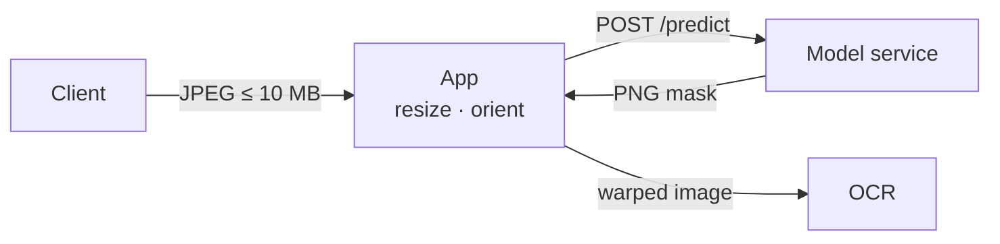
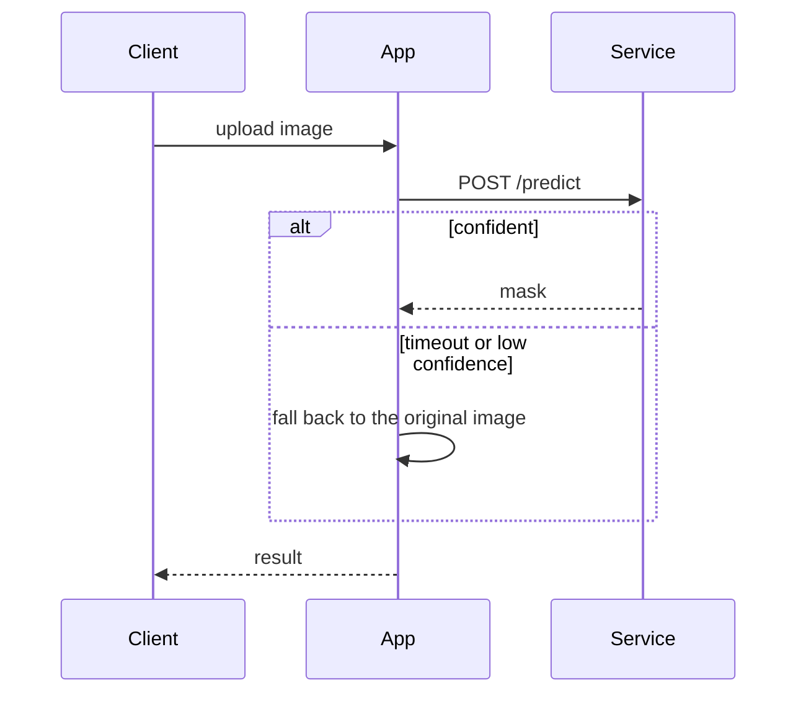

# Report Blueprints

Section skeletons for each lens. Keep the order; drop a section only when it has nothing true to say, and never pad one to fill it. Placeholders are in `<angle brackets>`. Translate the headings into the report's language.

## ds — data science / AI engineering

Reader: the people who build, tune, or ship the model. Goal: they can judge whether it solves the problem and reproduce every number.

````markdown
# <Model or method>: <task> — Evaluation

<YYYY-MM-DD> · <audience> · data: <N items, source> · env: <hardware, framework versions>

## TL;DR

- <Method> moved <metric> from **<baseline>** to **<result>** on <data>; improved <n> / regressed <m>.
- **Most of the gain came from <step>**; <other step> adds <+delta> on top.
- <Main failure mode>, seen in <n> of <N> items.
- <Main caveat: proxy metric, single run, tuned on the eval set>.

## 1. Problem statement

<Context: the system today, two or three sentences.>
<Problem, with its measured size.>

- **Goal / success criterion**: <metric> ≥ <threshold> on <data> (set <before | after> the work — say which).
- **Non-goals**: <what this work does not address>.

## 2. Data

| Item | Detail |
|---|---|
| Source | |
| Size / splits | |
| Labels | <ground truth or proxy; how produced> |
| Used for tuning? | <yes — the same set is reported / no — held out> |
| Leakage checks | |

## 3. Method and baseline

<Baseline: exactly what "before" is. Method: what changed, one short paragraph per component.>

## 4. Results

| Variant | <primary metric> | <secondary metric> | <failure rate> | n |
|---|---:|---:|---:|---:|
| baseline (<what>) | | | | |
| + <change 1> | | | | |
| **+ <change 2> (proposed)** | | | | |


> <Takeaway: which step bought the gain, and the confidence in it (seeds, CI, noise level).>

### 4.1 By slice

| Slice | n | baseline | proposed | Δ |
|---|---:|---:|---:|---:|

## 5. Error analysis

<Case blocks: best, worst (one per root cause), and the safety net working.>

## 6. Threshold / rule selection (if a decision rule was tuned)

| Rule | Triggers | Catches harm | Loses gain | <metric> |
|---|---:|---:|---:|---:|
| always apply | | | | |
| never apply | | | | |
| **<chosen rule>** | | | | |
| oracle: best per item (ceiling) | | | | |

## 7. Limitations
## 8. Next steps (ordered by value against cost)
## Appendix: reproducibility

| Item | Value |
|---|---|
| Code / commit | |
| Config | |
| Seeds / runs | |
| Raw results | `<path>` |
````

## swe — software engineering

Reader: the people who build, operate, or integrate the system. Goal: they understand the flow, the contract, the performance envelope, and the failure points.

````markdown
# <System or change>: Design & Performance

<YYYY-MM-DD> · <audience> · env: <hardware, versions, deployment> · load: <profile>

## TL;DR

- <Change> moved p95 latency from **<a>** to **<b>** and throughput from **<x>** to **<y>** at <concurrency>.
- <Where the time goes / the bottleneck now>.
- <Limit found: crashes or degrades at <load>, error <class>>.
- <Main caveat: profile, hardware, and what was not tested>.

## 1. Problem statement

<Context. Problem, with its measured size — for example, "p95 5.8 s against a 2 s SLA".>

- **Goal / success criterion**: <metric> <target> at <load>.
- **Non-goals**:

## 2. Process and architecture



<Which component owns which stage, and what each deliberately does NOT do.>



## 3. I/O contract

| Interface | Input | Output | Errors | Limits |
|---|---|---|---|---|
| `POST /predict` | multipart `file` (JPEG/PNG) | PNG 8-bit mask; headers `X-Inference-Ms` | 400 bad image · 503 overloaded | ≤ 10 MB, 4 concurrent |

Example request and response:

```bash
curl -F file=@sample.jpg http://host:8000/predict -o mask.png -D -
```

## 4. Performance

### 4.1 Method

| Item | Value |
|---|---|
| Hardware / versions | |
| Workload profile | <inputs, sizes — and how they match production> |
| Concurrency levels | |
| Warm-up | <excluded: first n requests> |
| Runs | |

### 4.2 Latency

| Variant | p50 | p95 | p99 | errors |
|---|---:|---:|---:|---:|
| before | | | | |
| **after** | | | | |

### 4.3 Throughput vs concurrency


| c | before | after |
|---:|---:|---:|

> <Takeaway: where each variant flattens, and why.>

### 4.4 Where the time goes

| Stage | p50 ms | share |
|---|---:|---:|

### 4.5 Resources

| Load | CPU | GPU util | Memory / VRAM |
|---|---:|---:|---:|

## 5. Failure modes and limits

| Condition | What happens | Reproduces? | Fallback / mitigation |
|---|---|---|---|

## 6. Deployment and operations

<Images, config, and environment variables that matter, health checks, and what to monitor.>

## 7. Limitations
## 8. Next steps (ordered by value against cost)
## Appendix: files and sources
````

### Cross-system comparison (inside Performance)

Use this when comparing hardware, engines, or configurations — including numbers other teams published.

```markdown
### Headline

| Metric (matched conditions) | <A> | <B> | <C> |
|---|---:|---:|---:|

> **Read this first:** <why a published number does not describe this workload, with the same sweep re-run at the production profile>.

| Profile | Mean speedup | At the ceiling |
|---|---:|---:|

### Relative vs absolute

<Speedup per stage, then absolute throughput — "what a user actually feels".>

### Caveats and honesty notes

- <Every asymmetry in method, and which side it favors.>
- <Every adjusted number, the reason, and where the raw value is shown.>
- Sources: <measured here: paths> · <transcribed from: report names>.
```

## Stakeholder version (either lens)

Reader: a manager, a client, or ops staff. Goal: they understand what changed, how much it helps, where it fails, and what they should do.

```markdown
# <Test results>: <plain name of the feature> for <system>

<Date> · test set: <N real items, described in plain words>

## Summary

<Two sentences: what was added, in plain words, and the overall effect.>

| <Metric in plain words> | <Second metric> | <Items improved> |
|---|---|---|
| **<a> → <b>** | **<a> → <b>** | **<n> / <N>** (worse <m>, similar <k>) |

> **Note:** <What the numbers are and are not>. <When real accuracy will be measured.>

## What <plain feature name> does

<Input → 1. <plain step> → 2. <plain step> → 3. <safety check> → Output — a simple Mermaid flowchart works here.>

## Overall results
## Examples that worked
## Examples that did not work
## Safety net
## Known limitations

| Limitation | Effect / what the system does |
|---|---|

## <Guidance for users>
## Next steps
```

## Case block

Use the same shape for every case so readers can compare cases at a glance.

```markdown
### <Plain description of the situation> — <better | worse | prevented> (`<case-id>`)


<Two or three sentences: what was wrong with the input, what the system did, and why the result changed.>

| | <Metric> | <Count> | <Failures> |
|---|---:|---:|---:|
| Current | | | |
| **New** | | | |

Key fields (current → new): <field> <value>: ✗ → ✓ · <field>: ✓ → ✓

| Output – current (first N lines) | Output – new (first N lines) |
|---|---|
| | |
```

Combine the three images of a case into one figure with matplotlib (three subplots with titles) rather than using raw HTML, so the Markdown stays portable.
